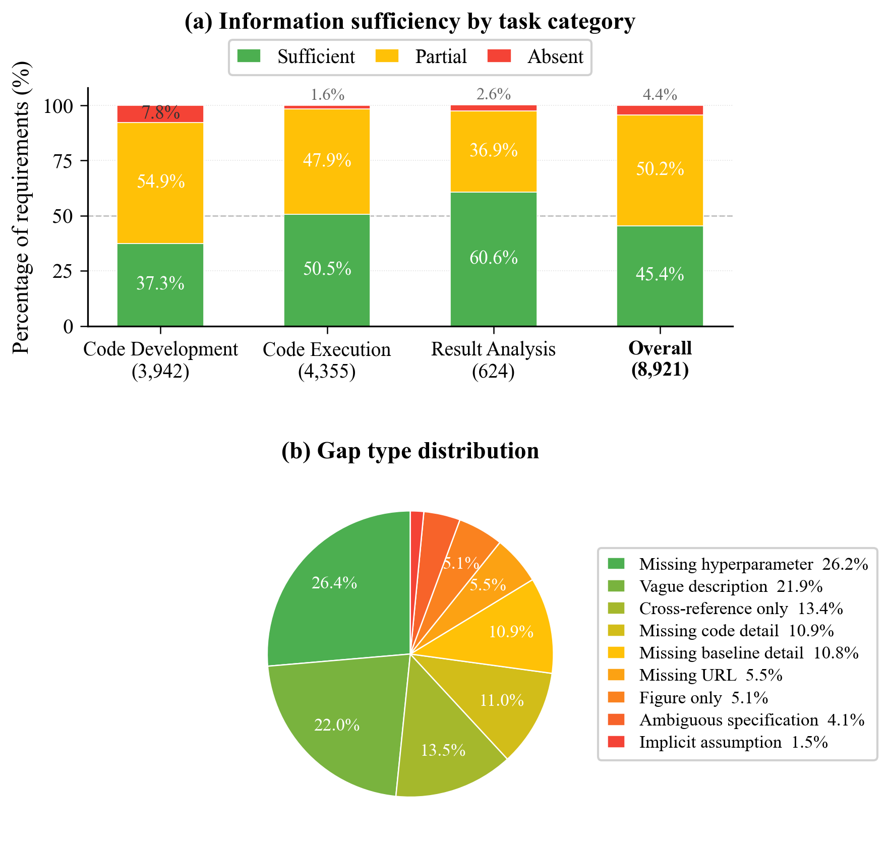
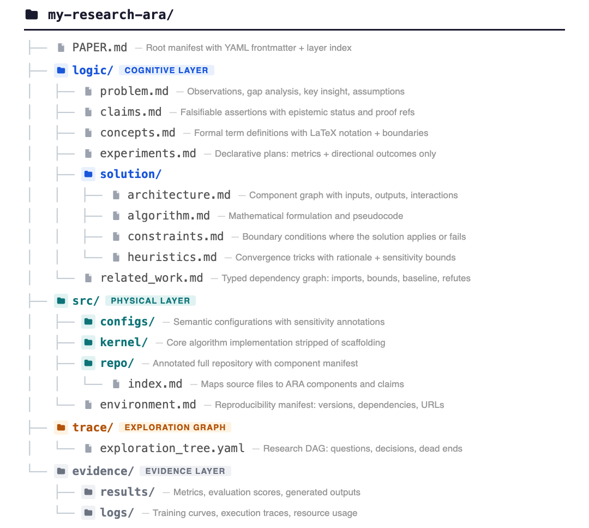
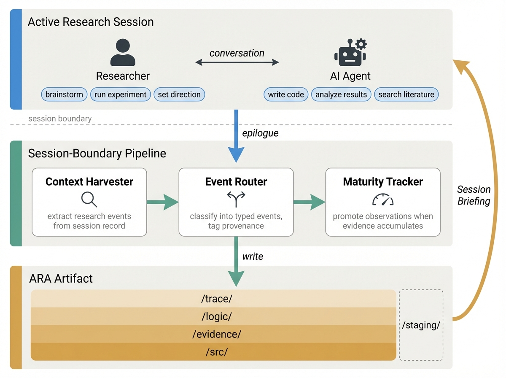

# Agent-Native Research Artifact (ARA)

[](LICENSE)
[](skills/)
[](https://orchestra-labs.com)

> A protocol that recasts the primary research object from narrative document to **machine-executable knowledge package** — so AI agents can navigate, reproduce, and extend published research without re-discovering every dead end.

<p align="center">
  
</p>

*Publishing compiles a rich research object into a lossy narrative (left); ARA preserves the original as a high-fidelity, machine-executable knowledge package (right).*

---

## The Problem

Research produces a branching knowledge object — months of hypotheses tested and rejected, implementation tricks discovered through trial and error, design alternatives weighed. Publishing compiles this into a linear narrative, discarding everything that doesn't fit the final story.

This was tolerable when every consumer was human. It is not when AI agents routinely read papers to reproduce experiments and extend published methods.

<p align="center">
  
</p>

**The numbers:**
- Only **45.4%** of 8,921 reproduction requirements from 23 ICML 2024 papers are fully specified in their PDFs ([PaperBench](https://openai.com/index/paperbench/))
- Failed agent runs account for **90.2%** of total dollar cost across 24,008 runs on RE-Bench — agents without prior failure records rediscover every dead end independently

---

## What is ARA?

ARA organizes research into four interlocking layers:

<p align="center">
  
</p>

```
artifact/
  PAPER.md                    # Root manifest + layer index (~200 tokens)
  logic/                      # Cognitive layer — What & Why
    problem.md                #   Observations → gaps → key insight
    claims.md                 #   Falsifiable assertions with proof refs
    concepts.md               #   Formal definitions
    experiments.md            #   Declarative experiment plans
    solution/
      architecture.md         #   System design + component graph
      algorithm.md            #   Math + pseudocode
      constraints.md          #   Boundary conditions
      heuristics.md           #   Implementation tricks + rationale
    related_work.md           #   Typed dependency graph
  src/                        # Physical layer — How
    configs/                  #   Hyperparameters with rationale
    environment.md            #   Dependencies, hardware, seeds
  trace/                      # Exploration graph — Journey
    exploration_tree.yaml     #   Research DAG with typed nodes + dead ends
  evidence/                   # Raw proof
    tables/                   #   Exact result tables
    figures/                  #   Extracted data points
```

<p align="center">
  
</p>

*Cross-layer forensic bindings thread claims in `/logic` to code in `/src` and evidence in `/evidence`. Dead-end nodes (×) in the exploration graph preserve failure modes.*

### Key design principles

- **Progressive disclosure** — `PAPER.md` (~200 tokens) tells agents whether the artifact is relevant. Deeper files load on demand.
- **Cross-layer binding** — Claims reference experiments, experiments reference evidence, heuristics reference code. Everything is linked.
- **Dead ends preserved** — Failed approaches and rejected alternatives are first-class nodes in the exploration graph, preventing agents from rediscovering known failures.
- **Provenance tracking** — Every entry carries a tag (`user`, `ai-suggested`, `ai-executed`, `user-revised`) distinguishing human-confirmed facts from AI inferences.

---

## Skills

This repository ships three open-source agent skills that work with ARA:

| Skill | Description | Invoke |
|-------|-------------|--------|
| **[ingestor](skills/ingestor/)** | Converts papers, repos, notes, or any research input into a structured ARA artifact | `/ingestor <path>` |
| **[research-manager](skills/research-manager/)** | Post-session research recorder with provenance tracking | `/research-manager` |
| **[rigor-reviewer](skills/rigor-reviewer/)** | ARA Seal Level 2 semantic epistemic review — scores six dimensions of research rigor | `/rigor-reviewer <artifact_dir>` |

### Ingestor (ARA Compiler)

<p align="center">
  
</p>

Converts ANY research input into a complete ARA artifact. Accepts PDFs, GitHub repos, experiment logs, code directories, raw notes, or combinations. Follows a 4-stage epistemic protocol:

1. **Semantic Deconstruction** — extract raw knowledge atoms
2. **Cognitive Mapping** — map to claims, concepts, experiments
3. **Physical Stubbing** — generate configs and code stubs
4. **Exploration Graph Extraction** — reconstruct the research DAG

```
/ingestor path/to/paper.pdf
/ingestor https://github.com/org/repo
/ingestor path/to/paper.pdf path/to/code/ --output ./my-artifact/
```

See [skills/ingestor/SKILL.md](skills/ingestor/SKILL.md) for the full specification.

### Research Manager (Live Capture)

<p align="center">
  
</p>

A post-session research recorder that extracts decisions, experiments, dead ends, claims, and heuristics from your coding session and writes them to an ARA artifact — capturing research knowledge as a natural side-effect of ordinary development.

```
/research-manager
```

See [skills/research-manager/SKILL.md](skills/research-manager/SKILL.md) for the full specification.

---

## Install

### Quick install (all agents)

```bash
npx skills add Orchestra-Research/Agent-Native-Research-Artifact
```

### Install a specific skill

```bash
npx skills add Orchestra-Research/Agent-Native-Research-Artifact --skill ingestor
```

### Manual install (Claude Code)

```bash
# All skills — project-level
cp -r skills/* .claude/skills/

# All skills — user-level (available in all projects)
cp -r skills/* ~/.claude/skills/

# Single skill
cp -r skills/ingestor ~/.claude/skills/ingestor
```

---

## Examples

| Artifact | Source | Description |
|----------|--------|-------------|
| [ResNet ARA](examples/resnet-ara-example/) | Paper + code | Deep residual network — canonical CV paper |
| [Scientific Reasoning ARA](ara-output/sci-reasoning/) | Paper | LLM research ideation patterns |
| [ANDES QoE ARA](ara-output/andes-qoe/) | Paper | LLM inference quality-of-experience |

See [examples/resnet-walkthrough.md](examples/resnet-walkthrough.md) for a step-by-step guide.

---

## Compatibility

These skills follow the [Agent Skills open standard](https://agentskills.io/specification) and work with:

- [Claude Code](https://claude.ai/code) (Anthropic)
- [Codex CLI](https://github.com/openai/codex) (OpenAI)
- [GitHub Copilot](https://github.com/features/copilot)
- [Cursor](https://cursor.com)
- Any agent supporting the Agent Skills specification

---
 
 

## Citation

If you use ARA in your research, please cite:

```bibtex
@article{ara2025,
  title   = {Agent-Native Research Artifact},
  author  = {Orchestra Research},
  year    = {2025},
  url     = {https://github.com/Orchestra-Research/Agent-Native-Research-Artifact}
}
```

---

## Contributing

See [CONTRIBUTING.md](CONTRIBUTING.md) for how to add or improve skills, or contribute ARA artifacts to `ara-output/`.

## License

[MIT](LICENSE)
